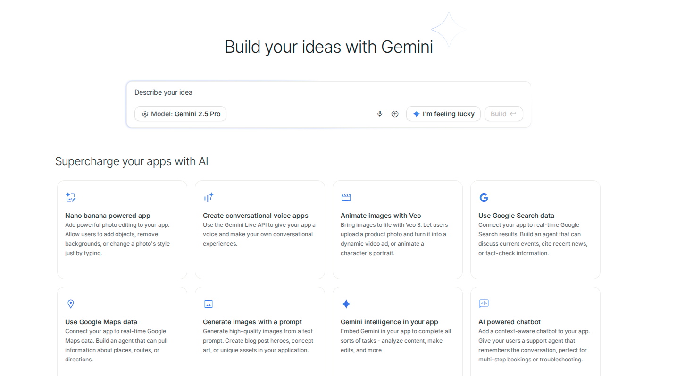
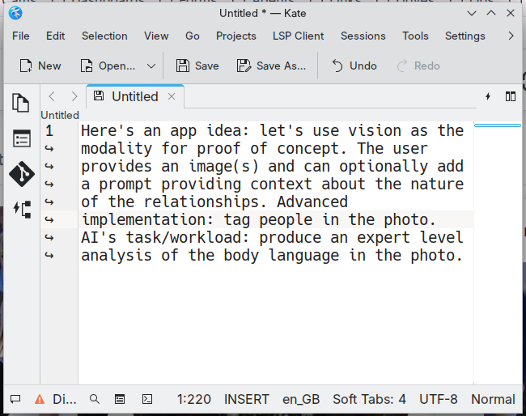
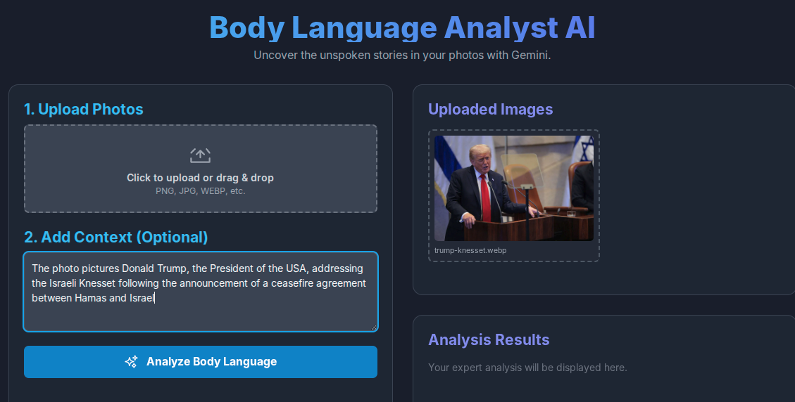
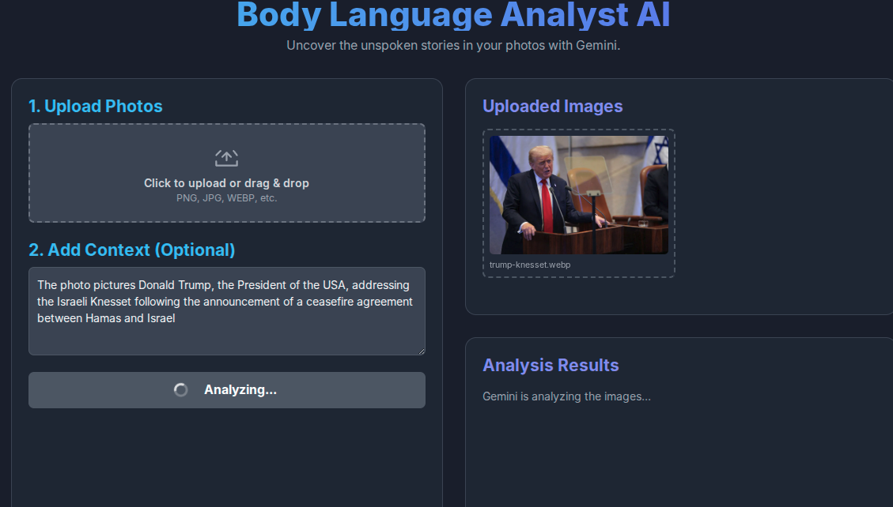
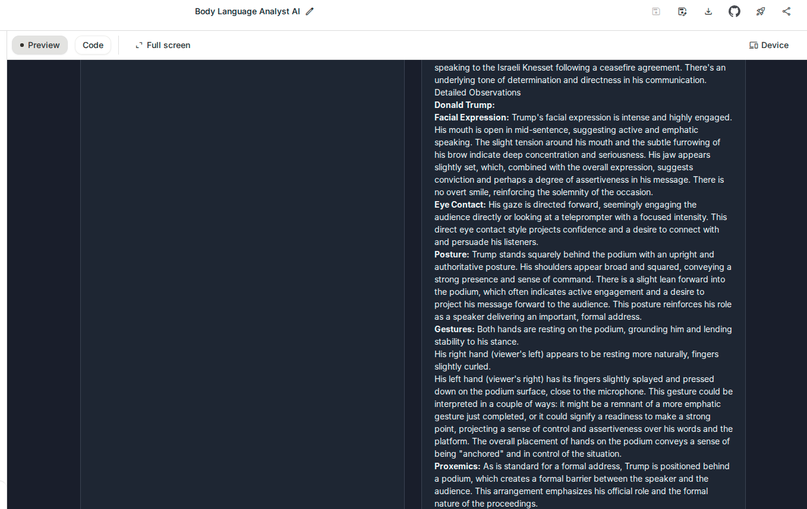

# Gemini Body Language Analyst

## Purpose

This repository was created to test and explore Google's new "vibe coding" interface integrated into [AI Studio](https://aistudio.google.com/apps). The interface allows developers to rapidly prototype AI-powered applications by describing their ideas in natural language, which Gemini then transforms into functional web applications.

## About the App

The **Body Language Analyst AI** is a vision-based application that analyzes body language in photographs using Gemini's multimodal capabilities.

### Features

- **Image Upload**: Upload one or multiple photos (PNG, JPG, WEBP, etc.)
- **Contextual Analysis**: Optionally provide context about the relationships and scenario in the photo
- **Expert-Level Analysis**: Receives detailed body language analysis including:
  - Facial expressions
  - Eye contact and gaze direction
  - Posture and positioning
  - Gestures and hand movements
  - Proxemics (spatial relationships)
  - Overall emotional state and intentions

### How It Works

1. Upload a photo containing people
2. Optionally add context about the situation or relationships
3. Click "Analyze Body Language"
4. Receive a comprehensive expert analysis of the body language displayed in the image

## The Vibe Coding Experience

The app was built using Google AI Studio's app builder interface, which streamlines the development process:


*The AI Studio app builder homepage showing various AI-powered app templates*


*The initial concept: Using vision as the modality for proof of concept, with advanced tagging of people and expert body language analysis*


*The upload interface with context input field*


*The app analyzing the uploaded image*


*Detailed body language analysis results showing facial expressions, posture, gestures, and proxemics*

## Key Takeaways

This experiment demonstrates:
- The rapid prototyping capabilities of AI Studio's vibe coding interface
- Gemini's multimodal vision capabilities for analyzing visual content
- How natural language descriptions can be transformed into functional applications
- The potential for building specialized AI tools with minimal traditional coding

## Technology

- **Platform**: Google AI Studio
- **Model**: Gemini 2.5 Pro
- **Modality**: Vision (image analysis)
- **Interface**: Web-based application generated through natural language description

## Setup

To run this application locally:

1. Clone the repository
2. Install dependencies:
   ```bash
   npm install
   ```
3. Create a `.env` file based on `.env.example`:
   ```bash
   cp .env.example .env
   ```
4. Add your Gemini API key to the `.env` file:
   - Get your API key from [Google AI Studio](https://aistudio.google.com/app/apikey)
   - Update `GEMINI_API_KEY` in the `.env` file
5. Start the development server:
   ```bash
   npm run dev
   ```
6. Open your browser to `http://localhost:3000`